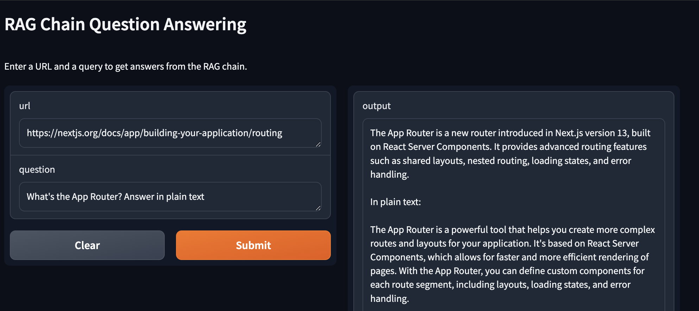

# Llama3 RAG Chatbot

This project provides the basics and demonstrates how to use Llama3 and a vector DB to create a chatbot that can answer questions about any webpage.

Built using: LangChain, OLlama, Llama3, ChromaDB and Gradio UI



## Pre-requisites

- Python 3.11 or higher
- OLlama server running

> Only tested on macOS Sonoma with Python 3.11.x

## Setup

1. Create a virtual environment:

   ```bash
   python -m venv .venv
   source .venv/bin/activate
   ```

2. Install dependencies:

   ```bash
   pip install -r requirements.txt
   ```

3. Run the app:
   ```bash
   python main.py
   ```

> You might need to replace `python` with `python3` depending on your system.

## References

- https://python.langchain.com/v0.1/docs/integrations/document_loaders/source_code/
- https://www.trychroma.com/
- https://www.youtube.com/watch?v=O7RdEyRsatw
